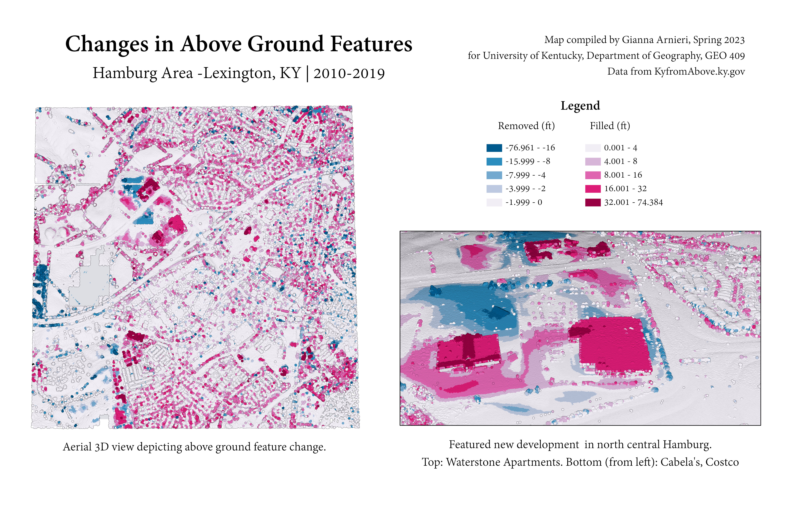

# Hamburg Area, Lexington KY - Mapping recent development
## 3D lidar map depicting changes in above ground feature development from 2010-2019

Published Thu, 4/6/2023 by Gianna Arnieri

This repository page can be accessed using the following URL:
https://garnieri.github.io/hamburg_development/

The Hamburg area has seen substantial residential and commercial development in the last decade. There has been lots of tree growth, as well as growth of local shopping centers. A small bit of land has been removed to make way for this development, but overall the landscape has been largely added to instead of taken away. 

     
*Hamburg area development from 2010-2019 highlighting commercial additions to the area*

[Link to high-resolution version](Layout.pdf)  

Map compiled by Gianna Arnieri for University of Kentucky
Department of Geography, GEO 409 Spring 2023
Data from KyfromAbove.ky.gov
